

Este repositório reúne uma coleção de temas para personalizar o ambiente de desenvolvimento do Python no IDLE, tornando sua experiência de codificação mais vibrante, inspiradora e produtiva. 

---

# **Lista de Temas:**

* `classic:`
* 
* `dark:`
* 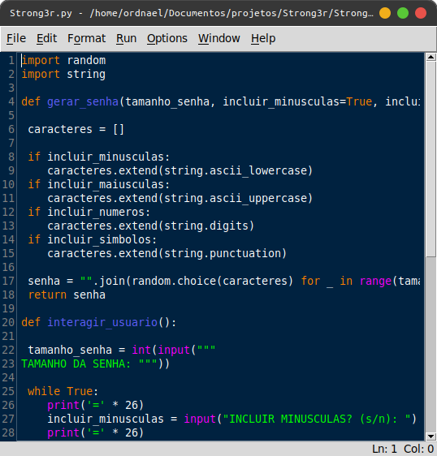
* `solarized light:`
* 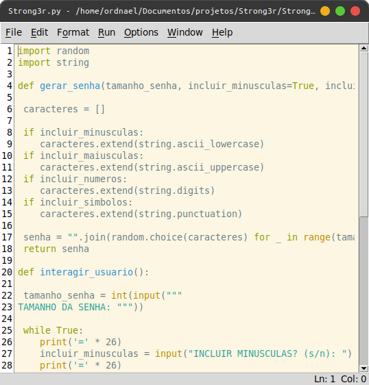
* `solarized dark:`
* 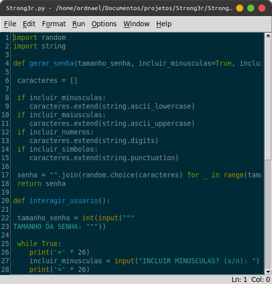
* `dracula:`
* 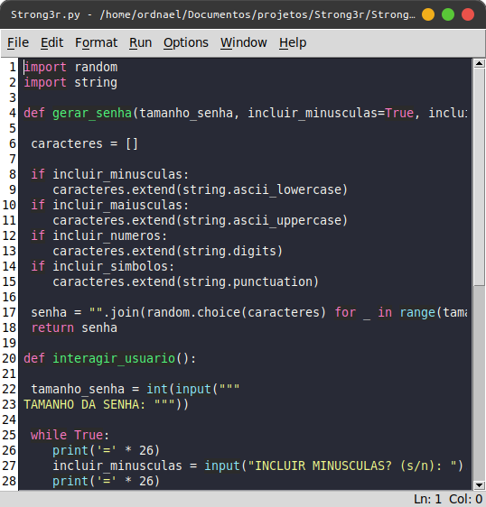
* `monokai:`
* 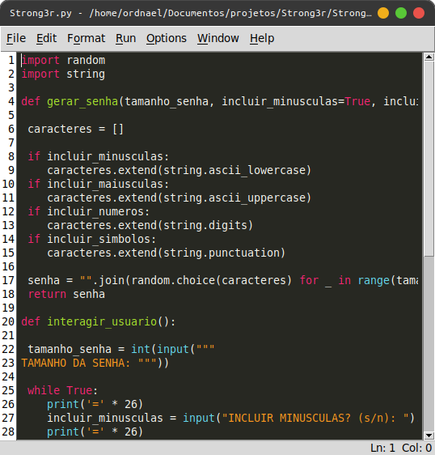
* `desert:`
* 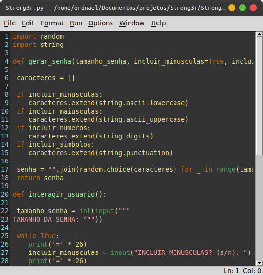
* `tango:`
* 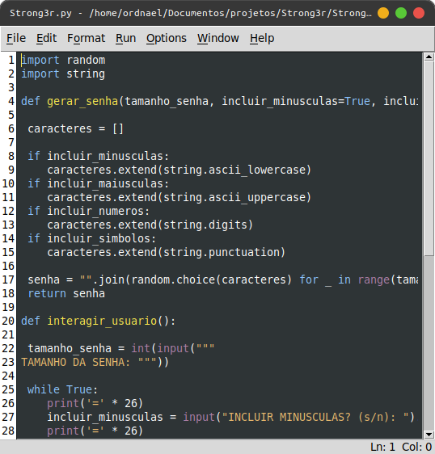
* `obsidian:`
* 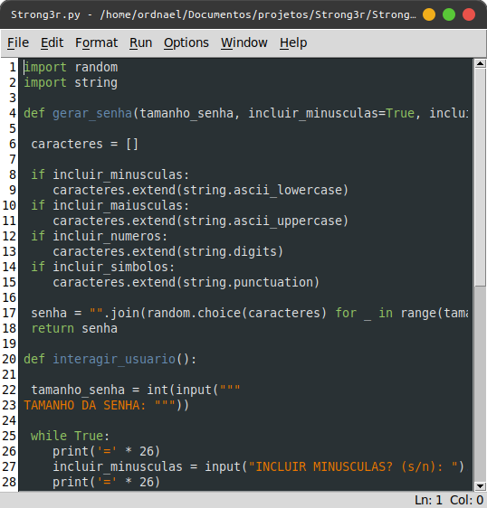
* `flampas:`
* 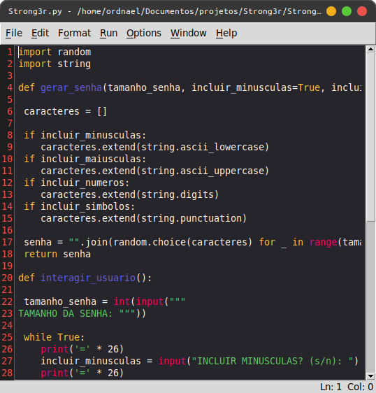
---

# **Instalação:**

* **Passo 1:** copie o conteudo do arquivo `.cfg` do tema desejado. Ex:

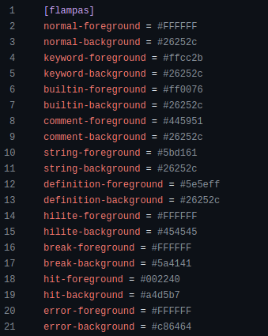

* **Passo 2:** cole o conteudo do tema escolhido em uma nova linha no arquivo `config-highlight.cfg` no diretorio `.idlerc`.

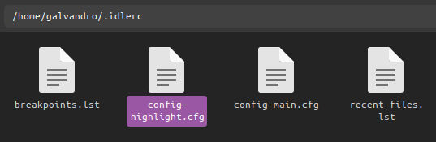

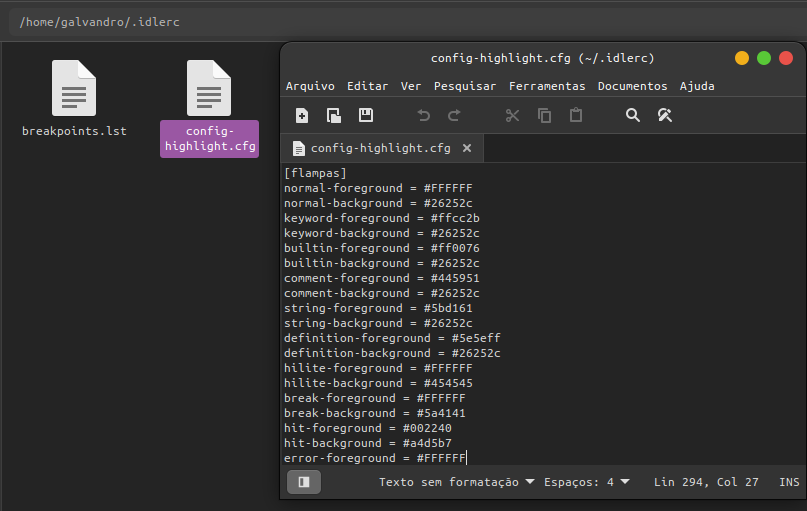

* **Passo 3:** aplique o tema, abrindo o IDLE, indo `highlight` nas coniuracoes, e escolhendo o tema.

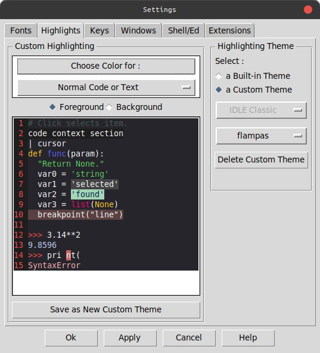
